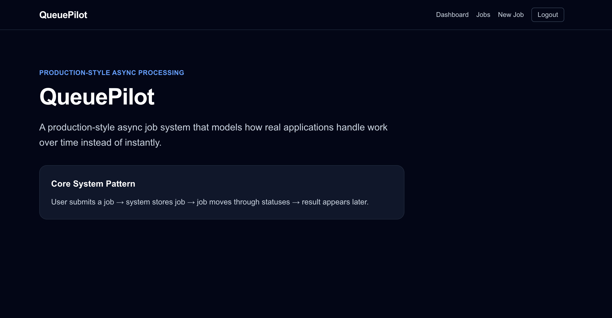
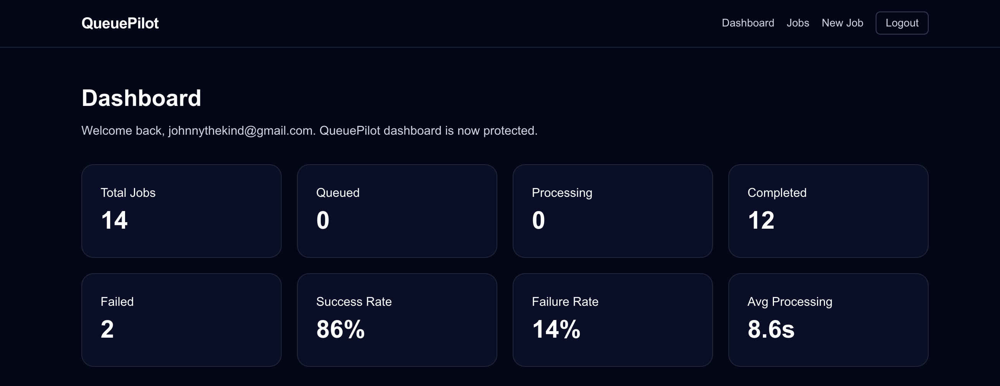
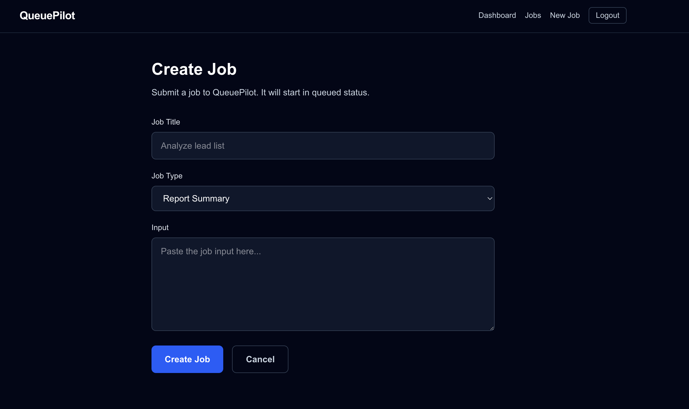
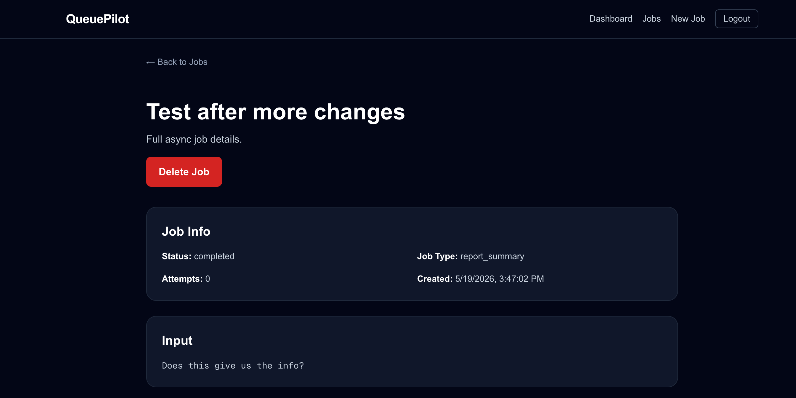
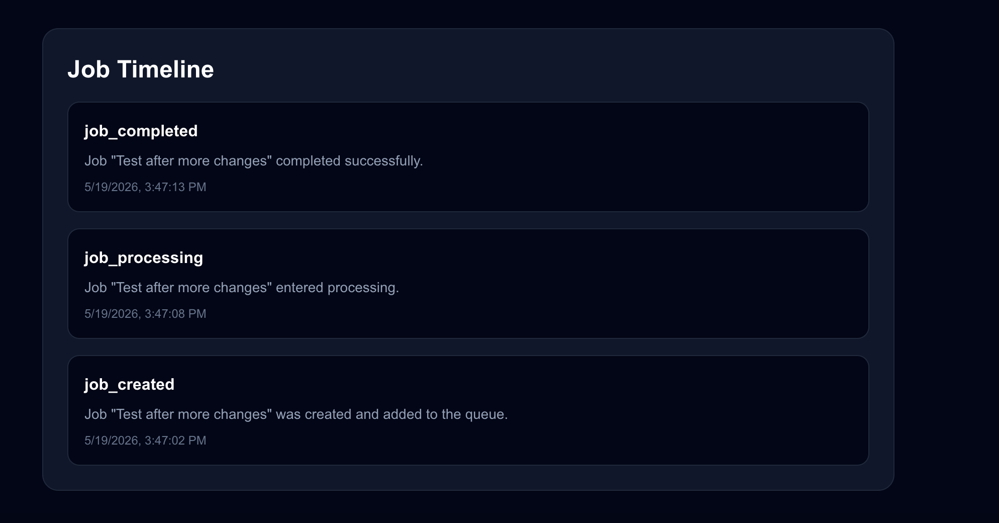
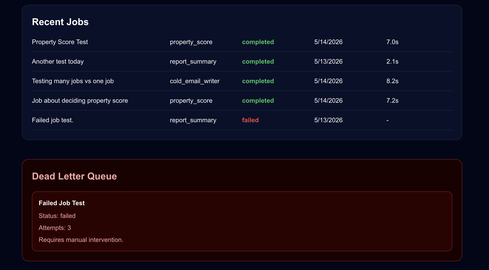

# QueuePilot

Production-style async job processing system built with Next.js, Supabase, and modern full-stack architecture patterns.

QueuePilot models how real-world systems process jobs over time instead of instantly — including queued states, processing workers, retries, failures, dead-letter queues, metrics dashboards, and event timelines.

---

## Overview

QueuePilot simulates a real async processing pipeline commonly used in:

- AI systems
- report generation systems
- background automation platforms
- email processing systems
- data pipelines
- enterprise SaaS applications

Instead of returning immediate responses, jobs move through a lifecycle:

```text
queued → processing → completed / failed
```

This project demonstrates how production systems manage delayed work, retries, failures, and observability.

---

## Core Features

### Async Job Lifecycle

- Create jobs
- Queue jobs
- Simulated background processing
- Status transitions
- Retry tracking
- Completion handling
- Failure handling

---

### Dashboard Metrics

Production-style dashboard displaying:

- Total jobs
- Queued jobs
- Processing jobs
- Completed jobs
- Failed jobs
- Success rate
- Failure rate
- Average processing time

---

### Dead Letter Queue (DLQ)

Failed jobs automatically move into a Dead Letter Queue after max retry attempts.

This models real enterprise infrastructure patterns used in:

- RabbitMQ
- Kafka
- AWS SQS
- BullMQ
- distributed worker systems

---

### Job Timeline / Event History

Each job stores lifecycle events such as:

- `job_created`
- `job_processing`
- `job_completed`
- `job_failed`

This creates a full processing audit trail.

---

### Protected Dashboard

Authentication-protected application routes using Supabase Auth.

---

## Tech Stack

### Frontend

- Next.js 16
- React
- TypeScript
- Tailwind CSS

### Backend

- Next.js Route Handlers
- Supabase Database
- Async processing simulation

### Authentication

- Supabase Auth

### Deployment

- Vercel

---

## System Architecture

```text
User submits job
        ↓
Job stored in database
        ↓
Job enters queue
        ↓
Worker processes job
        ↓
Job status updates
        ↓
Timeline events recorded
        ↓
Result appears in dashboard
```

---

## Key Production Concepts Demonstrated

This project demonstrates several real-world backend engineering concepts:

| Concept | Purpose |
|---|---|
| Async Processing | Work happens over time instead of instantly |
| Queue Systems | Jobs wait to be processed |
| Workers | Background processors handle tasks |
| Retry Logic | Failed jobs retry automatically |
| Dead Letter Queue | Persistent failed jobs isolated safely |
| Event Timelines | Full observability and auditing |
| Metrics Dashboard | Operational visibility |
| Protected Routes | Authentication & access control |

---

## Screenshots

### Landing Page



---

### Dashboard Metrics



---

### Create Job



---

### Job Detail



---

### Job Timeline



---

### Dead Letter Queue



---

## Local Development

### Clone Repository

```bash
git clone https://github.com/johnnythekind-ux/queuepilot.git
```

### Install Dependencies

```bash
npm install
```

### Run Development Server

```bash
npm run dev
```

### Open Application

```text
http://localhost:3000
```

---

## Environment Variables

Create a `.env.local` file:

```env
NEXT_PUBLIC_SUPABASE_URL=your_url
NEXT_PUBLIC_SUPABASE_PUBLISHABLE_KEY=your_key
SUPABASE_SERVICE_ROLE_KEY=your_service_key
```

---

## Future Improvements

Potential future enhancements:

- Real worker processes
- Redis/BullMQ integration
- WebSocket live updates
- Scheduled jobs
- Job priority levels
- Worker scaling
- Rate limiting
- Multi-tenant architecture
- Job cancellation
- File processing pipelines

---

## Why This Project Matters

Most beginner portfolio apps only demonstrate CRUD operations.

QueuePilot demonstrates:

- systems thinking
- async architecture
- backend workflow design
- operational visibility
- production engineering concepts

This project was intentionally designed to model patterns used in real-world scalable systems.

---

## Deployment

Deployed on Vercel.

---

## License

MIT